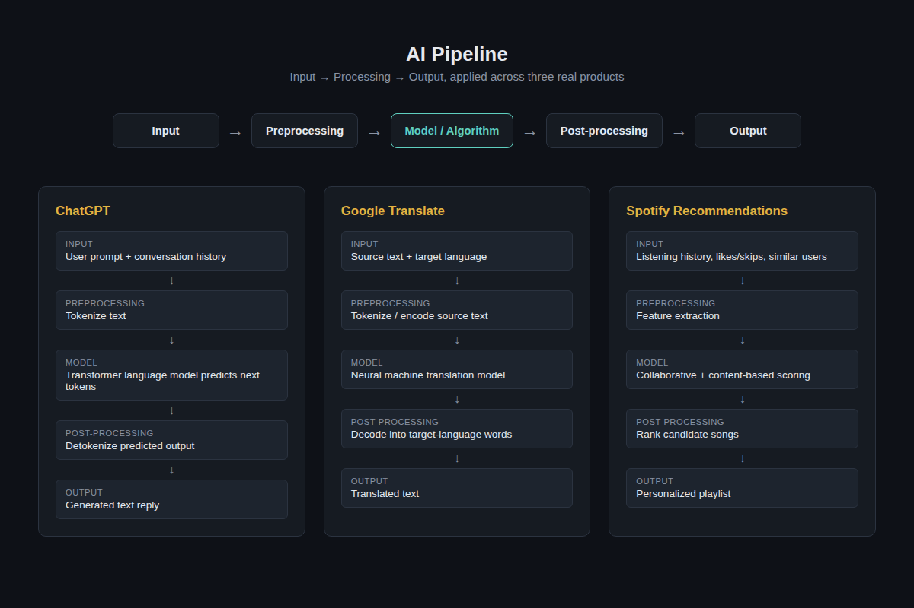
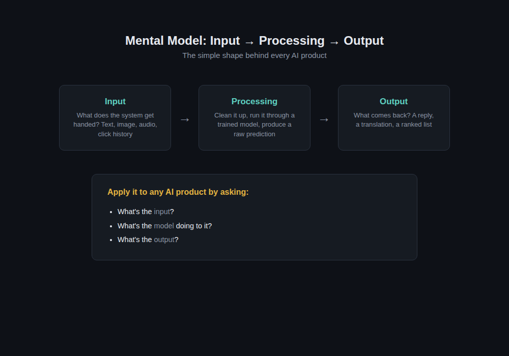

# Day 1

## Topic
- Introduction to AI Pipelines

## What I learned
- An AI pipeline follows: **Input → Processing → Output**
- Explored how this pattern applies to real products like ChatGPT, Google Translate, and Spotify

## 🤖 How a Chatbot Works

A chatbot takes your typed message as input and breaks it into smaller units called tokens. It feeds those tokens into a language model that was trained on massive amounts of text to learn patterns in how words follow one another. Based on your message and the conversation so far, the model predicts the most likely next tokens, one at a time, to build a response. It keeps generating tokens until it reaches a natural stopping point, like the end of a sentence or answer. Finally, those tokens are converted back into readable text and displayed to you as the chatbot's reply.